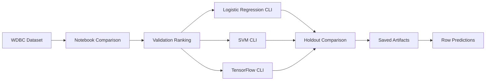

# mammo

[](https://www.python.org/)
[]()
[]()
[]()

> A breast tumour classification project on the Wisconsin Diagnostic Breast Cancer dataset, combining notebook-based model comparison with three deployable Python CLIs.

---

## Overview

`mammo` is an end-to-end machine learning project built on the **Wisconsin Diagnostic Breast Cancer (WDBC)** dataset. It starts with notebook-driven comparison, keeps validation results visible, and packages practical model choices as simple command-line tools.

What the repo includes:

- notebook-based model comparison and validation ranking
- deployable CLI workflows for `Logistic Regression`, `SVM`, and `TensorFlow NN`
- repeatable train / compare / predict commands
- smoke tests for all deployable model paths

---

## Snapshot

| Model | Holdout Snapshot | Artifact | Position |
|---|---|---|---|
| Logistic Regression | `0.9737 acc` / `0.9960 auc` | `models/logreg_model.pkl` | strongest lightweight baseline |
| SVM | `0.9737 acc` / `0.9947 auc` | `models/svm_model.pkl` | margin-based baseline |
| TensorFlow NN | `0.9649 acc` / `0.9917 auc` | `models/tensorflow_model/` | neural-network baseline |

Holdout metrics above come from the current CLI comparison flow in `scripts/compare_models.py`.

---

## Workflow



---

## Quickstart

### 1. Create the environment

```bash
python3 -m venv venv
source venv/bin/activate
```

### 2. Install what you need

CLI only:

```bash
pip install -r requirements/requirements.txt
```

Notebook workflow:

```bash
pip install -r requirements/requirements-notebook.txt
```

TensorFlow workflow:

```bash
pip install -r requirements/requirements-tensorflow.txt
```

---

## Commands

### Train

```bash
python scripts/logreg_cli.py train
python scripts/svm_cli.py train
python scripts/tensorflow_cli.py train
```

Each training command:

- loads the WDBC dataset
- trains on the training split
- evaluates on the untouched holdout split
- saves the exact evaluated artifact
- stores split and metric metadata with the artifact

### Compare

```bash
python scripts/compare_models.py
```

This command:

- evaluates `Logistic Regression` and `SVM` on the same holdout split
- includes `TensorFlow NN` when TensorFlow extras are installed
- prints one clean comparison table
- saves the result to `models/comparison_summary.csv`

Current CLI comparison snapshot:

| Model | Accuracy | Precision | Recall | F1 | ROC-AUC |
|---|---:|---:|---:|---:|---:|
| Logistic Regression | 0.9737 | 0.9756 | 0.9524 | 0.9639 | 0.9960 |
| SVM | 0.9737 | 1.0000 | 0.9286 | 0.9630 | 0.9947 |
| TensorFlow NN | 0.9649 | 0.9750 | 0.9286 | 0.9512 | 0.9917 |

### Predict

```bash
python scripts/logreg_cli.py predict --row-index 0
python scripts/svm_cli.py predict --row-index 0
python scripts/tensorflow_cli.py predict --row-index 0
```

Prediction output includes:

- row index
- patient ID
- actual diagnosis
- predicted diagnosis
- malignant probability

### Test

```bash
python -m unittest discover -s tests
```

The smoke suite checks that each CLI can train, save its artifact, and run `predict --row-index 0`.

---

## Notebook

Run the notebook server:

```bash
python -m notebook
```

Open:

- `notebooks/model-training-test.ipynb`

The notebook keeps the broader validation ranking view, while the CLI layer focuses on the deployable candidates.

<details>
<summary>Validation ranking snapshot</summary>

| Model | Accuracy | Precision | Recall | F1 | ROC-AUC |
|---|---:|---:|---:|---:|---:|
| Logistic Regression | 0.9737 | 1.0000 | 0.9302 | 0.9639 | **1.0000** |
| MLPClassifier | 0.9737 | 1.0000 | 0.9302 | 0.9639 | **1.0000** |
| TensorFlow Neural Network | 0.9737 | 1.0000 | 0.9302 | 0.9639 | **1.0000** |
| SVM | 0.9474 | 1.0000 | 0.8605 | 0.9250 | 0.9980 |
| Gradient Boosting | 0.9561 | 0.9750 | 0.9070 | 0.9398 | 0.9961 |
| kNN | 0.9561 | 1.0000 | 0.8837 | 0.9383 | 0.9959 |
| Random Forest | 0.9561 | 0.9750 | 0.9070 | 0.9398 | 0.9949 |
| Naive Bayes | 0.9298 | 0.9487 | 0.8605 | 0.9024 | 0.9912 |
| Decision Tree | 0.9123 | 0.9024 | 0.8605 | 0.8810 | 0.8942 |

</details>

---

## Project Layout

<details>
<summary>View file structure</summary>

```text
mammo/
├── data/
│   ├── wdbc.data
│   └── wdbc.names
├── models/
│   ├── comparison_summary.csv
│   ├── logreg_model.pkl
│   ├── svm_model.pkl
│   └── tensorflow_model/
│       ├── metadata.pkl
│       └── model.keras
├── notebooks/
│   └── model-training-test.ipynb
├── requirements/
│   ├── requirements.txt
│   ├── requirements-notebook.txt
│   └── requirements-tensorflow.txt
├── scripts/
│   ├── compare_models.py
│   ├── logreg_cli.py
│   ├── model_utils.py
│   ├── svm_cli.py
│   └── tensorflow_cli.py
├── tests/
│   └── test_cli_smoke.py
├── .gitignore
└── README.md
```

</details>

---

## Notes

- `requirements/requirements.txt` is the minimal CLI install
- `requirements/requirements-notebook.txt` adds notebook tooling
- `requirements/requirements-tensorflow.txt` adds TensorFlow support
- this project is for **educational and research use only**
- it is **not** intended for real clinical diagnosis

---

## Acknowledgement

- Wisconsin Diagnostic Breast Cancer dataset
